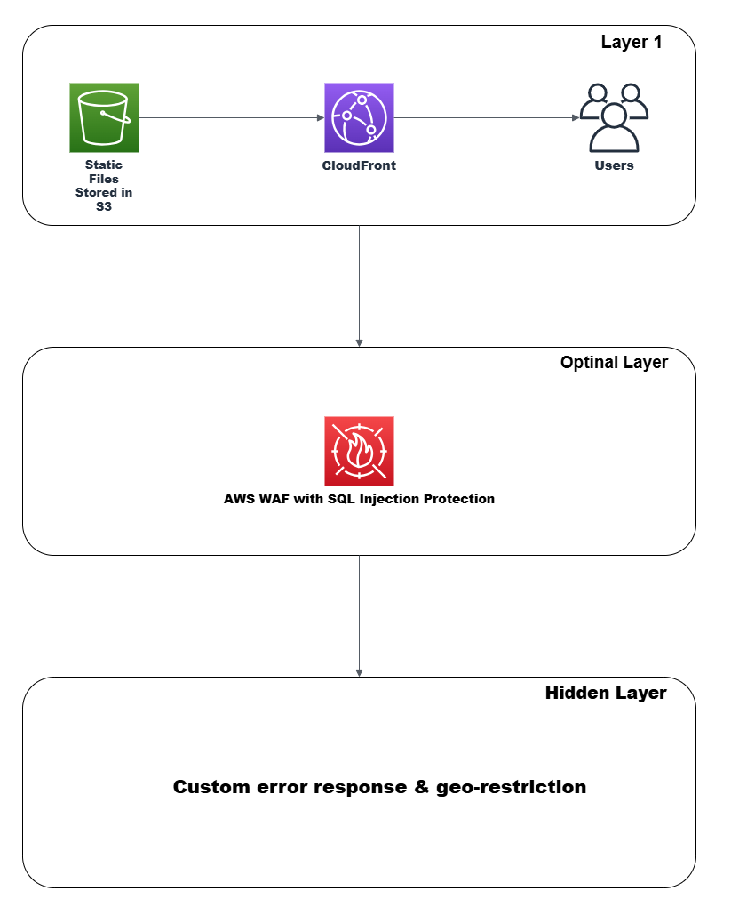

# Secure Static Web Hosting with AWS S3 & CloudFront

This project demonstrates how to host a static website on **Amazon S3**, served securely and globally via **Amazon CloudFront**, with advanced features like **geo-restriction**, **custom error pages**, and **WAF (Web Application Firewall)** protection.

> Built as part of the "Cloud Architecture and Protocol" practicals, this project shows how to secure and optimize static web delivery using industry-standard AWS tools.

---

## Table of Contents

- [Project Overview](#project-overview)
- [Architecture](#architecture)
- [Features](#features)
- [Tech Stack](#tech-stack)
- [Deployment Steps](#deployment-steps)
- [Testing & Validation](#testing--validation)
- [Project Structure](#project-structure)
- [Learnings](#learnings)

---

## Project Overview

-  **Hosting Type**: Static website hosting
- **Platform**: AWS S3 + CloudFront
- **Security Features**: Geo-blocking, SQL Injection WAF
- **Customizations**: 403 & 404 error pages
- **Access Control**: Public bucket policy + restricted distribution

---

## Architecture

---

## Key Features

- **Global CDN delivery** via CloudFront
- **Custom error pages** (403 + 404)
- **Geo-restriction** (country-based blocking)
- **WAF integration** with managed rule for SQL injection
- **Public S3 bucket** with proper ACLs and ownership rules

---

## Tech Stack

- **Amazon S3**: Static file hosting (HTML, error pages)
- **Amazon CloudFront**: CDN with origin from S3
- **AWS WAF**: Custom Web ACL with SQL injection rule
- **IAM Policies**: Secured access through bucket policy
- **Custom HTML**: `index.html`, `error.html`, `block.html`

---

## Deployment Steps

Detailed setup is in `deployment/step-by-step-deployment.md` :

1. Create & configure **S3 bucket**:
   - Enable static site hosting
   - Set bucket ACLs to allow public read
   - Upload `index.html`, `error.html`, `block.html`

2. Create **CloudFront distribution**:
   - Origin: S3 static website URL
   - Protocol: HTTP only
   - Enable custom error responses

3. Configure **Custom Error Pages**:
   - 403 → `/block.html`
   - 404 → `/error.html`

4. Attach **WAF ACL**:
   - Add AWS Managed Rule → SQL Database Rule Group

5. Enable **Geo-restriction**:
   - Block listed countries in CloudFront distribution settings

---

## Testing & Validation

| Test | Expected Result |
|------|------------------|
| Open `<distribution-domain>` | Website loads via CDN |
| Access non-existent page | Shows custom `error.html` (404) |
| Try SQL injection in URL | Returns `403 Forbidden` (WAF working) |
| Open site from blocked country | Returns `403 Forbidden` (Geo-restriction) |

---

## 📂 Project Structure
aws-cloudfront-s3-static-hosting/

├── architecture/
│ └── AWS_CloudFront_2368.pdf
├── deployment/
│ ├── step-by-step-deployment.md
│ └── test-cases.md
├── website/
│ ├── index.html
│ ├── error.html
│ └── block.html
├── LICENSE
└── README.md

---

## 📚 Learnings

- How to host and secure static websites on AWS
- CDN configuration and global content delivery
- Integration of WAF with CloudFront
- Access control and policy setup in S3
- Importance of geo-based and injection-based security rules

---